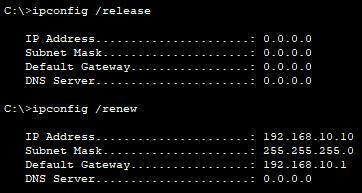

> Week4 Assignment 1: VLANs and Secure Switch Configuration
>
> **INTRODUCTION**
>
> This lab provides hands-on experience with two fundamental network
> security concepts: Virtual Local Area Networks (VLANs) and Switch
> Security. By effectively implementing these features, you can create a
> more secure and organized network environment. Traditional LANs can
> become congested and vulnerable to security breaches due to
> unrestricted broadcast traffic. Devices on the same network segment
> can see all broadcasted packets, potentially compromising sensitive
> information or allowing unauthorized access.
>
> VLANs offer a solution by logically dividing a single physical switch
> into multiple broadcast domains. Devices within the same VLAN can
> communicate directly, while traffic is isolated from devices in other
> VLANs. This reduces broadcast traffic, improves network performance,
> and enhances security by limiting access to specific network segments.
>
> Switches play a crucial role in securing networks by providing control
> over access to switch ports. This lab will explore various switch
> security features, including:
>
> • Port Security: Restricts unauthorized devices from accessing switch
> ports by only allowing pre-configured MAC addresses.
>
> • Secure Dynamics: A feature where the switch automatically learns and
> adds authorized device MAC addresses to a secure list based on
> observed traffic.
>
> • VLAN Hopping Prevention: Techniques to prevent unauthorized access
> to different VLANs by restricting inter-VLAN traffic flow**.**
>
> **Addressing** **Table** **below** **used** **for** **configuration**
> **and** **connections**

||Device 	Interface / VLAN 	IP Address 	Subnet Mask 
||R1 	G0/0/1 	192.168.10.1 	255.255.255.0 
||1 	Loopback 0 	10.10.1.1 	255.255.255.0 
||Device 	Interface / VLAN 	IP Address 	Subnet Mask 
||S1 	VLAN 10 	192.168.10.201 	255.255.255.0
||S2 	VLAN 10 	192.168.10.202 	255.255.255.0 
||PC – A 	NIC 	DHCP 	255.255.255.0 
||PC – B 	NIC 	DHCP 	255.255.255.0 
||

> **OBJECTIVE**
>
> The objectives of this lab include;
>
> **Part** **1:** **Configure** **the** **Network** **Devices.**
>
> • Cable the network.
>
> • Configure R1.
>
> • Configure and verify basic switch settings.
>
> **Part** **2:** **Configure** **VLANs** **on** **Switches.**
>
> • Configure VLAN 10.
>
> • Configure the SVI for VLAN 10.
>
> • Configure VLAN 333 with the name Native on S1 and S2.
>
> • Configure VLAN 999 with the name ParkingLot on S1 and S2.
>
> **Part** **3:** **Configure** **Switch** **Security.**
>
> • Implement 802.1Q trunking.
>
> • Configure access ports.
>
> • Secure and disable unused switchports.
>
> • Document and implement port security features.
>
> • Implement DHCP snooping security.
>
> • Implement PortFast and BPDU guard.
>
> • Verify end-to-end-connectivity.

**Required** **Resources**

> • 1 Router (Cisco 4221 with Cisco IOS XE Release 16.9.3 universal
> image or comparable) • 2 Switches (Cisco 2960 with Cisco IOS Release
> 15.0(2) lanbasek9 image or comparable) • 2 PCs (Windows with a
> terminal emulation program, such as Tera Term)
>
> • Console cables to configure the Cisco IOS devices via the console
> ports • Ethernet cables as shown in the topology
>
> **Methodology**
>
> **Part** **1:** **Configure** **the** **Network** **Devices.**
>
> ***Step*** ***1:*** ***Cable*** ***the*** ***network.***
>
> 1\. Cable the network as shown in the topology.
>
> 2\. Initialize the devices.

***Step*** ***2:*** ***Configure*** ***R1.***

1\. Load the following configuration script on R1.

enable

configure terminal hostname R1

> no ip domain lookup

ip dhcp excluded-address 192.168.10.1 192.168.10.9

> ip dhcp excluded-address 192.168.10.201 192.168.10.202

!

ip dhcp pool Students network 192.168.10.0 255.255.255.0

> default-router 192.168.10.1
>
> domain-name secure.com

! interface Loopback0

> ip address 10.10.1.1 255.255.255.0

!

interface GigabitEthernet0/0/1

> description Link to S1 Port 5
>
> ip dhcp relay information trusted
>
> ip address 192.168.10.1 255.255.255.0
>
> no shutdown

! line con 0

> logging synchronous
>
> exec-timeout 0 0

Renaming the Router to R1 and disabling DNS lookup feature with no ip
domain lookup configuration

Setting up no-ip dhcp range of addresses

> 3\. Verify the running-configuration on R1 using the following
> command:

***Step*** ***3:*** ***Configure*** ***and*** ***verify*** ***basic***
***switch*** ***settings.***

> 1\. Configure the hostname for switches S1 and S2.

Open configuration window

**Switch#** **config** **t**

**Switch(config)#** **hostname** **S1**

Open configuration window

**Switch#** **config** **t**

**Switch(config)#**
**hostname** **S2**

> 2\. Prevent unwanted DNS lookups on both switches. S1(config)# no ip
> domain-lookup
>
> S2(config)# no ip domain-lookup
>
> 3\. Configure interface descriptions for the ports that are in use in
> S1 and S2. S1(config)# interface f0/1
>
> S1(config-if)# description Link to S2 S1(config–if)# interface f0/5
> S1(config-if)# description Link to R1 S1(config–if)# interface f0/6
>
> S1(config-if)# description Link to PC-A

***Step*** ***1:*** ***Configure*** ***VLAN*** ***10.***

1\. Add VLAN 10 to S1 and S2 and name the VLAN **Management.**

S1(config)# vlan 10

S1(config-vlan)# name Management

S2(config)# vlan 10

S2(config-vlan)# name Management

***2:*** ***Configure*** ***the*** ***SVI*** ***for*** ***VLAN***
***10.***

Configure the IP address according to the Addressing Table for SVI for
VLAN 10 on S1 and S2. Enable the SVI interfaces and provide a
description for the interface.

***Step*** ***3:***
***Configure*** ***VLAN*** ***333*** ***with*** ***the*** ***name***
***Native*** ***on*** ***S1*** ***and*** ***S2.***

**Step** **4:** **Configure** **VLAN** **999** **with** **the** **name**
**ParkingLot** **on** **S1** **and** **S2.**

S1(config-vlan)# vlan 999

S1(config-vlan)# name ParkingLot

**Part** **3:** **Configure** **Switch** **Security.**

***Step*** ***1:*** ***Implement*** ***802.1Q*** ***trunking.***

> 1\. Verify that trunking is configured on both switches.
>
> 2.
> Verify that trunking is configured on both switches.

3. Disable DTP negotiation on
F0/1 on S1 and S2.

>  style="width:4.18833in;height:3.34333in" />4. Verify with the **show**
> **interfaces** command.

***Step*** ***2:*** ***Configure*** ***access*** ***ports.***

> On S1, configure F0/5 and F0/6 as access ports that are associated
> with VLAN 10
>
> 1\. On S2, configure F0/18 as an access port that is associated with
> VLAN 10.
>
> ***Step*** ***3:*** ***Secure*** ***and*** ***disable*** ***unused***
> ***switchports.***

1.
On S1 and S2, move the unused ports from VLAN 1 to VLAN 999 and disable
the unused ports.

>  style="width:5.93833in;height:2.20833in" />2. Verify that unused ports
> are disabled and associated with VLAN 999 by issuing the **show**
> command.
>
> ***Step*** ***4:*** ***Document*** ***and*** ***implement***
> ***port*** ***security*** ***features.***
>
> The interfaces F0/6 on S1 and F0/18 on S2 are configured as access
> ports. In this step, you will also configure port security on these
> two access ports.
>
>  style="width:5.64667in;height:1.46833in" />1. On S1, issue the
> **show** **port-security** **interface** **f0/6** command to display
> the default port security settings for interface F0/6. Record your
> answers in the table below.

||
||
||
||
||
||
||
||
||
||
||

> 2\. On S1, enable port security on F0/6 with the following settings:
>
> • Maximum number of MAC addresses: 3
>
> • Violation type: restrict
>
> • Aging time: 60 min switchport port-security aging type inactivity
>
> •
> Aging type: inactivity

> 3\. Verify port security on S1 F0/6.
>
>  style="width:4.80167in;height:0.59333in" />4. Enable port security for
> F0/18 on S2. Configure the port to add MAC addresses learned on the
> port automatically to the running configuration.

> 5\. the following port security settings on S2 F/18:
>
> • Maximum number of MAC addresses: **2** • Violation type: **Protect**
>
> • Aging time: **60** **min**
>
> 6\. Configure Verify port security on S2 F0/18.

***5:*** ***Implement*** ***DHCP*** ***snooping*** ***security.***

> 1\. On S2, enable DHCP snooping and configure DHCP snooping on VLAN
> 10.
>
> 2\. Configure the trunk port on S2 as a trusted port.
>
> 3\. Limit the untrusted port, F18 on S2, to five DHCP packets per
> second.

> 4\. Verify DHCP Snooping on S2.
>
> 5\. From the command prompt on PC-B, release and then renew the IP
> address. C:\Users\Student\> **ipconfig** **/release**
> C:\Users\Student\> **ipconfig**
>
> **/renew**
>
>  style="width:6.31333in;height:2.46833in" />6. Verify the DHCP snooping
> binding using the **show** **ip** **dhcp** **snooping** **binding**
> command.

**Step** **6:** **Implement** **PortFast** **and** **BPDU** **guard.**

> 1\. Configure PortFast on all the access ports that are in use on both
> switches
>
> 2\. Enable BPDU guard on S1 and S2 VLAN 10 access ports connected to
> PC-A and PC-B.
>
> 3\. Verify that BPDU guard and PortFast are enabled on the appropriate
> ports.
>
> ***Step*** ***7:*** ***Verify*** ***end-to-end*** ***connectivity.***
>
> Verify PING connectivity between all devices in the IP Addressing
> Table. If the pings fail, you may need to disable the firewall on the
> PC hosts.

> **Questions** **to** **answer**
>
> 1\. In reference to Port Security on S2, why is there no timer value
> for the remaining age in minutes when sticky learning was configured?
>
> **This** **switch** **does** **not** **support** **the** **port**
> **security** **aging** **of** **sticky** **secure** **addresses.**
>
> 2\. In reference to Port Security on S2, if you load the
> running-config script on S2, why will PC-B on port 18 never get an IP
> address via DHCP?
>
> **Port** **security** **is** **set** **for** **only** **two** **MAC**
> **addresses** **and** **port** **18** **has** **two** **“sticky”**
> **MAC** **address** **bound** **to** **the** **port.**
> **Additionally,** **the** **violation** **is** **protect,** **which**
> **will** **never** **send** **a** **console/syslog** **message**
> **or** **increment** **the** **violation** **counter.**
>
> 3\. In reference to Port Security, what is the difference between the
> absolute aging type and inactivity aging type?
>
> **If** **the** **inactivity** **type** **is** **set,** **then**
> **the** **secure** **addresses** **on** **the** **port** **will**
> **be** **removed** **only** **if** **there** **is** **no** **data**
> **traffic** **from** **the** **secure** **source** **addresses**
> **for** **the** **specified** **time** **period.** **If** **the**
>
> **absolute** **type** **is** **set,** **then** **all** **secure**
> **addresses** **on** **this** **port** **age** **out** **exactly**
> **after** **the** **time** **specified** **ends.**

**<u>Device Configurations – Final</u>**

**<u>Switch S1</u>**

S1#show running-config

Building configuration...

Current configuration : 3179 bytes

!

version 15.0

no service timestamps log datetime msec

no service timestamps debug datetime msec

no service password-encryption

!

hostname S1

!

!

!

no ip domain-lookup

!

!

!

spanning-tree mode pvst

spanning-tree extend system-id

!

interface FastEthernet0/1

description Link S1

switchport trunk native vlan 333

switchport mode trunk

switchport nonegotiate

!

interface FastEthernet0/2

switchport access vlan 999

switchport mode access

shutdown

!

interface FastEthernet0/3

switchport access vlan 999

switchport mode access

shutdown

!

interface FastEthernet0/4

switchport access vlan 999

switchport mode access

shutdown

!

interface FastEthernet0/5

description Link to R1

switchport access vlan 10

switchport mode access

spanning-tree portfast

!

interface FastEthernet0/6

description Link to PC-A

switchport access vlan 10

switchport mode access

switchport port-security

switchport port-security maximum 3

switchport port-security violation restrict

switchport port-security mac-address 0022.5646.3411

switchport port-security aging time 60

spanning-tree portfast

spanning-tree bpduguard enable

!

interface FastEthernet0/7

switchport access vlan 999

switchport mode access

shutdown

!

interface FastEthernet0/8

switchport access vlan 999

switchport mode access

shutdown

!

interface FastEthernet0/9

switchport access vlan 999

switchport mode access

shutdown

!

interface FastEthernet0/10

switchport access vlan 999

switchport mode access

shutdown

!

interface FastEthernet0/11

switchport access vlan 999

switchport mode access

shutdown

!

interface FastEthernet0/12

switchport access vlan 999

switchport mode access

shutdown

!

interface FastEthernet0/13

switchport access vlan 999

switchport mode access

shutdown

!

interface FastEthernet0/14

switchport access vlan 999

switchport mode access

shutdown

!

interface FastEthernet0/15

switchport access vlan 999

switchport mode access

shutdown

!

interface FastEthernet0/16

switchport access vlan 999

switchport mode access

shutdown

!

interface FastEthernet0/17

switchport access vlan 999

switchport mode access

shutdown

!

interface FastEthernet0/18

switchport access vlan 999

switchport mode access

shutdown

!

interface FastEthernet0/19

switchport access vlan 999

switchport mode access

shutdown

!

interface FastEthernet0/20

switchport access vlan 999

switchport mode access

shutdown

!

interface FastEthernet0/21

switchport access vlan 999

switchport mode access

shutdown

!

interface FastEthernet0/22

switchport access vlan 999

switchport mode access

shutdown

!

interface FastEthernet0/23

switchport access vlan 999

switchport mode access

shutdown

!

interface FastEthernet0/24

switchport access vlan 999

switchport mode access

shutdown

!

interface GigabitEthernet0/1

switchport access vlan 999

switchport mode access

shutdown

!

interface GigabitEthernet0/2

switchport access vlan 999

switchport mode access

shutdown

!

interface Vlan1

no ip address

shutdown

!

interface Vlan10

description Management SVI

ip address 192.168.10.201 255.255.255.0

!

ip default-gateway 192.168.10.1

!

**Device** **Configurations** **–** **Final(Switch2)**

**Switch** **S2**

S2#show running-config Building configuration...

Current configuration : 3490 bytes

!

version 15.0

no service timestamps log datetime msec no service timestamps debug
datetime msec no service password-encryption

!

hostname S2 !

! !

no ip domain-lookup !

!

ip dhcp snooping vlan 10

no ip dhcp snooping information option ip dhcp snooping

!

spanning-tree mode pvst spanning-tree extend system-id

S2#show running-config Building configuration...

Current configuration : 3490 bytes !

version 15.0

no service timestamps log datetime msec no service timestamps debug
datetime msec no service password-encryption

!

hostname S2 !

! !

no ip domain-lookup !

!

ip dhcp snooping vlan 10

no ip dhcp snooping information option ip dhcp snooping

!

spanning-tree mode pvst spanning-tree extend system-id !

interface FastEthernet0/1 description Link to S1

switchport trunk native vlan 333 ip dhcp snooping trust switchport mode
trunk switchport nonegotiate

!

interface FastEthernet0/2 switchport access vlan 999 switchport mode
access shutdown

!

interface FastEthernet0/3 switchport access vlan 999 switchport mode
access shutdown

!

interface FastEthernet0/4 switchport access vlan 999 switchport mode
access shutdown

!

interface FastEthernet0/5 switchport access vlan 999 switchport mode
access shutdown

!

interface FastEthernet0/6 switchport access vlan 999 switchport mode
access shutdown

!

interface FastEthernet0/7 switchport access vlan 999 switchport mode
access shutdown

!

interface FastEthernet0/8 switchport access vlan 999 switchport mode
access

switchport port-security maximum 2 switchport port-security violation
protect switchport port-security aging time 60 shutdown

!

interface FastEthernet0/9 switchport access vlan 999 switchport mode
access

shutdown !

interface FastEthernet0/10 switchport access vlan 999 switchport mode
access shutdown

!

interface FastEthernet0/11 switchport access vlan 999 switchport mode
access shutdown

!

interface FastEthernet0/12 switchport access vlan 999 switchport mode
access shutdown

!

interface FastEthernet0/13 switchport access vlan 999 switchport mode
access shutdown

!

interface FastEthernet0/14 switchport access vlan 999 switchport mode
access shutdown

!

interface FastEthernet0/15 switchport access vlan 999 switchport mode
access shutdown

!

interface FastEthernet0/16 switchport access vlan 999 switchport mode
access shutdown

!

interface FastEthernet0/17 switchport access vlan 999 switchport mode
access shutdown

!

interface FastEthernet0/18 description Link to PC-B switchport access
vlan 10

ip dhcp snooping limit rate 5

switchport mode access switchport port-security

switchport port-security maximum 2 switchport port-security mac-address
sticky switchport port-security violation protect

switchport port-security mac-address sticky 0022.5646.3413 switchport
port-security mac-address sticky 0060.7099.B7E5 switchport port-security
aging time 60

spanning-tree bpduguard enable !

interface FastEthernet0/19 switchport access vlan 999 switchport mode
access shutdown

!

interface FastEthernet0/20 switchport access vlan 999 switchport mode
access shutdown

!

interface FastEthernet0/21 switchport access vlan 999 switchport mode
access shutdown

!

interface FastEthernet0/22 switchport access vlan 999 switchport mode
access shutdown

!

interface FastEthernet0/23 switchport access vlan 999 switchport mode
access shutdown

!

interface FastEthernet0/24 switchport access vlan 999 switchport mode
access shutdown

!

interface GigabitEthernet0/1 switchport access vlan 999 switchport mode
access shutdown

!

interface GigabitEthernet0/2

switchport access vlan 999 switchport mode access shutdown

!

interface Vlan1 no ip address shutdown

!

interface Vlan10

description Management SVI

ip address 192.168.10.202 255.255.255.0 !

ip default-gateway 192.168.10.1 !

**CONCLUSION**

This lab has equipped me with the skills to implement essential network
security techniques using VLANs and switch security features on Cisco
switches. I have effectively learned how to;

> • Configure VLANs to segment your network and isolate traffic.
>
> • Implement port security to restrict access to specific switch ports.
>
> • Understand and potentially utilize Secure Dynamics for automatic
> device learning.
>
> • Secure unused switch ports and prevent unauthorized access.
>
> • Verify switch configurations and test network connectivity.
