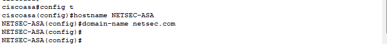
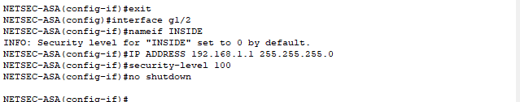
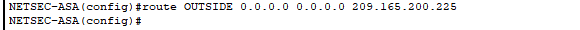
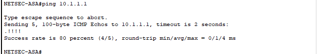
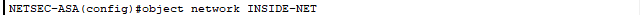

**Introduction**

This lab guides on how to configure a Cisco Adaptive Security Appliance
(ASA) and leverage its features to establish a secure connection between
an internal network and the wide world internet. It also delves on
securing r networks with a powerful firewall. The case study in this lab
deals with a company network connected to an ISP. The critical role of
securing this connection falls on the ASA firewall. This lab simulates
this scenario using Packet Trace to configure the ASA to act as a
security gateway, filtering unwanted traffic and enabling secure
communication between your internal network and the internet. Ensure
access is granted by configuring access for both internal network
administrators and a remote administrator, ensuring secure management
and automation of IP assignment.

**Addressing Table**

  -------------------------------------------------------------------------------
  **Device**   **Interface**   **IP Address**     **Subnet Mask**   **Default
                                                                    Gateway**
  ------------ --------------- ------------------ ----------------- -------------
  R1           G0/0            209.165.200.225    255.255.255.248   N/A

  *R1*         S0/0/0 (DCE)    10.1.1.1           255.255.255.252   *N/A*

  R2           S0/0/0          10.1.1.2           255.255.255.252   N/A

  *R2*         S0/0/1 (DCE)    10.2.2.2           255.255.255.252   *N/A*

  R3           G0/1            172.16.3.1         255.255.255.0     N/A

  *R3*         S0/0/1          10.2.2.1           255.255.255.252   *N/A*

  ASA          G1/1            209.165.200.226    255.255.255.248   NA

  *ASA*        G1/2            192.168.1.1        255.255.255.0     *NA*

  *ASA*        G1/3            192.168.2.1        255.255.255.0     *NA*

  DMZ Server   NIC             192.168.2.3        255.255.255.0     192.168.2.1

  PC-B         NIC             192.168.1.3        255.255.255.0     192.168.1.1

  PC-C         NIC             172.16.3.3         255.255.255.0     172.16.3.1
  -------------------------------------------------------------------------------

  : This table shows the addressing for the Device, Interface, IP
  Address, Subnet Mask and Default gateway.

**Scenario**

Your company has one location connected to an ISP. R1 represents a CPE
device managed by the ISP. R2 represents an intermediate Internet
router. R3 represents an ISP that connects an administrator from a
network management company, who has been hired to remotely manage your
network. The ASA is an edge CPE security device that connects the
internal corporate network and DMZ to the ISP while providing NAT and
DHCP services to inside hosts. The ASA will be configured for management
by an administrator on the internal network and by the remote
administrator. The ISP assigned the public IP address space of
209.165.200.224/29, which will be used for address translation on the
ASA.

All router and switch devices have been preconfigured with the
following:

o    Enable password: **ciscoenpa55**

o    Console password: **ciscoconpa55**

o    Admin username and password: **admin**/**adminpa55**

**Objectives**

The key objectives of this lab include:

   Verify connectivity and explore the ASA

  Configure basic ASA settings and interface security levels using CLI

  Configure routing, address translation, and inspection policy using
CLI

  Configure DHCP, AAA, and SSH

 Configure a DMZ, Static NAT, and ACLs

**Methodology**

**Part 1: Verify Connectivity and Explore the ASA**

**Step 1: Verify connectivity.**

The ASA is not currently configured. However, all routers, PCs, and the
DMZ server are configured. Verify that PC-C can ping any router
interface. PC-C is unable to ping the ASA, PC-B, or the DMZ server

{width="6.5in" height="5.395833333333333in"}

**Step 2: Determine the ASA version, interfaces, and license.**

Use the **show version** command to determine various aspects of this
ASA device.

{width="6.5in" height="6.394444444444445in"}

**Step 3: Determine the file system and contents of flash memory.**

a.     Enter privileged EXEC mode. A password has not been set.
Press **Enter** when prompted for a password.

b.     Use the **show file system** command to display the ASA file
system and determine which prefixes are supported. The prefixes
supported are **disk0:flash**

{width="4.552081146106737in" height="0.71875in"}

c.     Use the **show flash:** or **show disk0:** command to display the
contents of flash memory.

{width="6.5in" height="2.4069444444444446in"}

**Part 2: Configure ASA Settings and Interface Security Using the CLI**

**Tip**: Many ASA CLI commands are similar to, if not the same, as those
used with the Cisco IOS CLI. In addition, the process of moving between
configuration modes and submodes is essentially the same.

**Step 1: Configure the hostname and domain name.**

a.     Configure the ASA hostname as **NETSEC-ASA**.

{width="6.5in" height="0.75in"}

b.     Configure the domain name as **netsec.com**.

{width="6.5in" height="0.75in"}

**Step 2: Configure the enable mode password.**

Use the **enable password** command to change the privileged EXEC mode
password to **ciscoenpa55**.

{width="6.5in" height="0.5104166666666666in"}

**Step 3: Set the date and time.**

Use the **clock set** command to manually set the date and time.

{width="3.7296872265966754in"
height="0.3229615048118985in"}

**Step 4: Configure the INSIDE and OUTSIDE interfaces.**

You will only configure the G1/1 (OUTSIDE) and G1/2 (INSIDE) interfaces
at this time. The G1/3 (DMZ) interface will be configured in Part 5 of
the activity.

a.     Create the G1/1 interface for the outside network
(209.165.200.224/29), set the security level to the lowest setting of 0,
and enable the interface.

{width="6.5in" height="1.5416666666666667in"}

b.     Configure the G1/2 interface for the inside network
(192.168.1.0/24) and set the security level to the highest setting of
100 and enable the interface.

{width="6.5in" height="1.28125in"}

c.     Use the following verification commands to check your
configurations:

1)     Use the **show interface ip brief** command to display the status
for all ASA interfaces.

{width="6.5in" height="2.21875in"}

2)     Use the **show ip address** command to display the interface
information.

{width="6.5in" height="3.452777777777778in"}

**Step 5: Test connectivity to the ASA.**

a.     You should be able to ping from PC-B to the ASA inside interface
address (192.168.1.1). If the pings fail, troubleshoot the configuration
as necessary.

{width="6.355053587051619in"
height="3.4796522309711286in"}

b.     From PC-B, ping the G1/1 (OUTSIDE) interface at IP address
209.165.200.226. You should not be able to ping this address.

{width="5.834146981627296in"
height="2.50034886264217in"}

**Part 3: Configure Routing, Address Translation, and Inspection Policy
Using the CLI**

**Step 1: Configure a static default route for the ASA.**

Configure a default static route on the ASA OUTSIDE interface to enable
the ASA to reach external networks.

a.     Create a "quad zero" default route using the **route** command,
associate it with the ASA OUTSIDE interface, and point to the R1 G0/0 IP
address (209.165.200.225) as the gateway of last resort.

{width="6.042509842519685in"
height="0.3125437445319335in"}

b.     Issue the **show route** command to verify the static default
route is in the ASA routing table.

{width="6.5in" height="2.5083333333333333in"}

c.     Verify that the ASA can ping the R1 S0/0/0 IP address 10.1.1.1.
If the ping is unsuccessful, troubleshoot as necessary. **The ping is
successful**

{width="6.5in" height="1.1152777777777778in"}

{width="6.459234470691164in"
height="1.1980839895013122in"}

**Step 2: Configure address translation using PAT and network objects.**

a.     Create network object **INSIDE-NET** and assign attributes to it
using the **subnet** and **nat** commands.

{width="6.3358989501312335in"
height="0.148244750656168in"}

{width="6.583333333333333in"
height="0.5138888888888888in"}

b.     The ASA splits the configuration into the object portion that
defines the network to be translated and the actual **nat** command
parameters. These appear in two different places in the running
configuration. Display the NAT object configuration using the **show
run **command.

{width="5.648515966754156in"
height="3.9466524496937883in"}

{width="6.5in" height="3.7645833333333334in"}

c.     From PC-B attempt to ping the R1 G0/0 interface at IP address
209.165.200.225. The pings should fail.

{width="6.209199475065617in"
height="2.1252963692038493in"}

d.     Issue the **show nat** command on the ASA to see the translated
and untranslated hits. Notice that, of the pings from PC-B, four were
translated and four were not. The outgoing pings (echos) were translated
and sent to the destination. The returning echo replies were blocked by
the firewall policy.

{width="6.5in" height="0.6375in"}

**Part 4: Configure DHCP, AAA, and SSH**

**Step 1: Configure the ASA as a DHCP server.**

a.     Configure a DHCP address pool and enable it on the ASA INSIDE
interface.

{width="6.5in" height="0.32222222222222224in"}

b.    Specify the IP address of the DNS server to be given to clients.

{width="6.5in" height="0.1111111111111111in"}

c.     Enable the DHCP daemon within the ASA to listen for DHCP client
requests on the enabled interface (INSIDE).

{width="6.5in" height="0.2423611111111111in"}

d.     Change PC-B from a static IP address to a DHCP client and verify
that it receives IP addressing information. Troubleshoot, as necessary
to resolve any problems

{width="6.5in" height="4.676388888888889in"}

**Step 2: Configure AAA to use the local database for authentication.**

a.     Define a local user named **admin** by entering
the **username** command. Specify a password of **adminpa55**.

{width="6.5in" height="0.48541666666666666in"}

b.     Configure AAA to use the local ASA database for SSH user
authentication.

{width="6.5in" height="0.21388888888888888in"}

**Step 3: Configure remote access to the ASA.**

The ASA can be configured to accept connections from a single host or a
range of hosts on the INSIDE or OUTSIDE network. In this step, hosts
from the OUTSIDE network can only use SSH to communicate with the ASA.
SSH sessions can be used to access the ASA from the inside network.

a.     Generate an RSA key pair, which is required to support SSH
connections. Because the ASA device has RSA keys already in place,
enter **no** when prompted to replace them.

{width="6.5in" height="0.9125in"}

b.     Configure the ASA to allow SSH connections from any host on the
INSIDE network (192.168.1.0/24) and from the remote management host at
the branch office (172.16.3.3) on the OUTSIDE network. Set the SSH
timeout to 10 minutes (the default is 5 minutes).

{width="6.5in" height="0.51875in"}

c.     Establish an SSH session from PC-C to the ASA (209.165.200.226).
Troubleshoot if it is not successful.

{width="6.282127077865267in"
height="2.4065857392825896in"}

d.     Establish an SSH session from PC-B to the ASA (192.168.1.1).
Troubleshoot if it is not successful.

{width="6.386307961504812in"
height="0.4792333770778653in"}

**Part 5: Configure a DMZ, Static NAT, and ACLs**

R1 G0/0 and the ASA OUTSIDE interface already use 209.165.200.225 and
.226, respectively. You will use public address 209.165.200.227 and
static NAT to provide address translation access to the server.

**Step 1: Configure the DMZ interface VLAN 3 on the ASA.**

a.  Configure DMZ VLAN 3, which is where the public access web server
    will reside. Assign it IP address 192.168.2.1/24, name it **DMZ**,
    and assign it a security level of 70. Because the server does not
    need to initiate communication with the inside users, disable
    forwarding to interface VLAN 1.

> {width="6.5in" height="1.1104166666666666in"}
>
> b.     Use the following verification commands to check your
> configurations:
>
> Use the **show interface ip brief** command to display the status for
> the ASA interfaces.
>
> Use the **show ip address** command to display the information for the
> ASA interfaces.
>
> {width="6.5in" height="3.5861111111111112in"}
>
> {width="6.479166666666667in"
> height="3.6618055555555555in"}

**Step 2: Configure static NAT to the DMZ server using a network
object.**

Configure a network object named **DMZ-SERVER** and assign it the static
IP address of the DMZ server (192.168.2.3). While in object definition
mode, use the **nat** command to specify that this object is used to
translate a DMZ address to an OUTSIDE address using static NAT, and
specify a public translated address of 209.165.200.227.

{width="6.5in" height="0.6638888888888889in"}

**Step 3: Configure an ACL to allow access to the DMZ server from the
Internet.**

Configure a named access list **OUTSIDE-DMZ** that permits the TCP
protocol on port 80 from any external host to the internal IP address of
the DMZ server. Apply the access list to the ASA OUTSIDE interface in
the "IN" direction.

{width="6.5in" height="0.5833333333333334in"}

**Step 4: Test access to the DMZ server.**

From a web browser on PC-C, navigate to the DMZ server
(209.165.200.227). Troubleshoot if it is not successful.

{width="6.261290463692038in"
height="3.6255063429571304in"}

**Conclusion**

This lab provided me with hands-on experience with configuring a Cisco
ASA firewall to secure network gateways. I have successfully implemented
essential security measures using the ASA\'s capabilities. I have learnt
how to secure management access for both internal network administrators
and a remote administrator, ensuring authorized control and management.
I have also been equipped with knowledge on how to configure Network
Address Translation (NAT) to manage private IP addresses for secure
internet access as well as configuring a Demilitarized Zone (DMZ) for
controlled external access.
